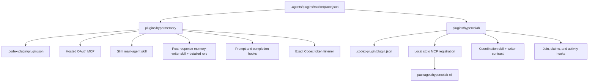
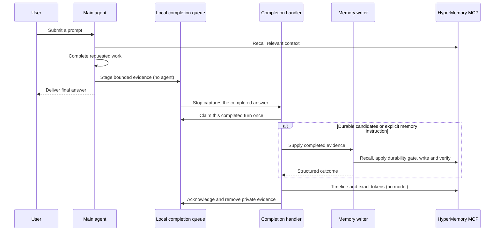
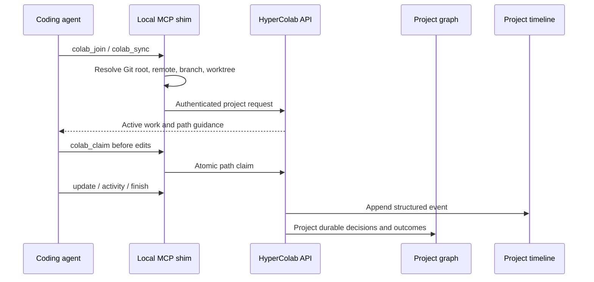

# Architecture

The repository contains one marketplace catalog and two independently
installable plugins. Shared branding and distribution live at the repository
level; runtime behavior remains isolated by plugin.

## Package topology

## HyperMemory lifecycle

The main agent recalls context and stages a small local contract. It never
starts a writer during the Codex turn. The Stop hook launches a bounded handler
only after the public answer exists. That handler invokes a fresh ephemeral
Codex memory session only for candidate durable work or explicit memory requests.
The writer must process every supported candidate or report the exact unresolved
reason. A duplicate is hydrated and verified; it is not silently discarded.
Bookkeeping uses authenticated MCP calls directly and never needs a model.

The native transport uses `codex app-server` and the existing Codex OAuth store;
it does not extract credentials or require an API key. Its private ephemeral
session has recursive hooks and unrelated tools disabled. It neither resumes
the parent nor adds a user-facing task or response. The handler has a finite
runtime, and ambiguous remote failures are held for review instead of replayed.

The prompt hook prepares a token job and instructs the main agent to stage a
bounded contract. The Stop hook captures only its public final answer. It never
blocks with a synthetic continuation. The first prompt establishes the session
usage baseline once. There is no `SessionStart` hook or alternate completion
source; jobs use `lifecycle: post_response`.

Completion claims are exclusive. Repeated Stop events cannot start a second
handler. Missing handoffs create no candidate memories. Partial remote failures
retain private evidence with `needs_review` status. Completed jobs discard the
answer and contract. Unsupported completion formats fail closed.

The token listener parses only counters and session identities. Direct logging
runs even with no memory candidates. Exact inspect/send/ack operations are
serialized per session. Missing exact counters fail explicitly. Memory, timeline
and parent token phases use independent connections and preserve their receipts,
so one failure cannot suppress the others. Background model usage is reported
separately under its actual model and session using native token notifications.

## HyperColab lifecycle

The local shim is intentional: it derives repository identity locally so an
agent cannot choose another project's graph or timeline identifier. Redis holds
short-lived sessions, claims, and leases; the project graph and append-only
timeline remain the durable systems of record.

## Hooks and trust

Both plugins use the default `hooks/hooks.json` discovery path. Plugin hooks
are non-managed, so Codex requires users to review and trust their exact
definition. Changed hook content receives a new hash and must be reviewed again.

HyperMemory hooks add hidden recall instructions and create bounded
token-listener jobs without user-visible status messages. HyperColab hooks load
project context, check writes against claims, and record structured activity.
The HyperColab launcher degrades safely when its CLI is missing: it explains
the prerequisite at session start and does not block writes in an unconfigured
environment.

## Agent packaging

The current OpenAI plugin manifest supports skills, MCP servers, apps, hooks,
and presentation assets; it does not define a separate auto-installed custom
agent registry. HyperMemory therefore exposes a slim implicit main skill and a
second `$memory-writer` skill whose implicit invocation is disabled.
On Codex, the completion handler passes it only to a fresh background session
with candidate durable work. Other supported hosts can delegate bounded work:

- `plugins/hypermemory/agents/memory-writer.md` defines HyperMemory finalization;
  `$memory-writer` points hosts to that canonical contract.
- `coordination-agent.md` defines delegated HyperColab timeline maintenance.

The skills instruct the host when to spawn these bounded roles, what context to
provide, and how to prevent recursive delegation. The `agents/openai.yaml`
files alongside each skill provide OpenAI skill interface metadata and MCP
dependencies; they are not custom-agent TOML files.

## Authentication boundaries

- HyperMemory uses the hosted MCP's OAuth flow. Codex stores MCP OAuth state;
  the plugin contains only the server URL.
- HyperColab authenticates through `hypercolab login`. Credentials remain in
  local HyperColab configuration and are not embedded in `.mcp.json`.
- Token provenance and cost provenance are independent. The plugin never
  invents provider-actual billing data.

## Surface behavior

| Capability | ChatGPT | Codex |
| --- | --- | --- |
| HyperMemory hosted MCP and skill | Supported through MCP/plugin publication | Supported through Git marketplace or public directory |
| HyperMemory exact local token delta | Not exposed by consumer ChatGPT | Supported through local rollout counters |
| HyperColab skill | Supported where installed | Supported |
| HyperColab local MCP shim and Git hooks | Requires a local surface able to launch the CLI | Supported in local CLI/app/IDE workflows |
| Plugin lifecycle hooks | Surface-dependent | Supported after explicit trust |
